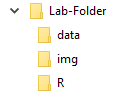

```{r setup, include=FALSE}
# This is a R `code chunk`;
#   'setup' is the name of code chunk
#      (This name is not needed; but if used, it has to be unique)
#   'include=FALSE' is so that the code and the results are not included in the final document.
knitr::opts_chunk$set(echo = TRUE)
# The above line sets the default for all code chunks to 'echo', which means show the codes and the results in the final document. 
```

## Introduction

The goal of this document is to show how RMarkdown can use used to create reproducible documents in HTML, PDF, and MS Word formats. For more details on using R Markdown see <http://rmarkdown.rstudio.com>.

### Prerequisites

To be able to use R Markdown, an installation of R software is essential; use one of these [CRAN Mirrors](https://cran.r-project.org/mirrors.html) to find an appropriate installation file.

Although not necessary, it is highly recommended that RStudio, an integrated development environment (IDE) for R (and Python!), is also installed: the free [RStudio Desktop](https://www.rstudio.com/products/rstudio/download/) version is sufficient.

Finally, if not installed, these packages need to be installed:

-   knitr
-   rmarkdown

Those may need other packages, including *evaluate, digest, highr, markdown, yaml, Rcpp, htmltools, jsonlite, base64enc,* and *mime*.

The following code **chunk**, named `installPreReq`, install those packages and other requirements that could come handy:

```{r installPreReq, eval=FALSE}
# 'eval=FALSE' means do not run this code chunk.
install.packages("installr")
library(installr)
install.Rtools()
install.packages('devtools')
install.packages(c('evaluate', 'digest', 'highr', 'markdown', 'yaml',
                    'Rcpp', 'htmltools', 'knitr', 'jsonlite', 'base64enc', 
                    'mime', 'rmarkdown'))
```

When these are installed, RStudio shows the **Knit** button on top of the script editor window. The *knit* button can be used to start the process of converting an Rmd file into a HTML, PDF or MS Word file. 

## Capabilities

The above section of this document presented examples of including R codes, adding hyperlink, and creating a document structure with text headings using `#` and `##` marks.

In the rest of this document, examples of other capabilities of R Markdown are shown. In these examples, it is assumed that the document is generated in Rstudio.

### Adding an Image

The following image shows the folder structure used for this lab-template:



This Rmd file is located in `R` folder, image files used here (like the one above) are located in `img` folder, data files are located in `data` folder. All these folders are are located under `Lab-Folder`.

Instead of embedding an image, a link to it can be provided; here is a link to the same [Folder Strucrure image](../img/FolderStructure.png).

### Adding formula

Simple LaTeX commands can be used as inline formulas, like $\hat y = b_0 + b_1 x$, or displayed formulas $$\bar x = \sum_{i=1}^n \frac{x_i}{n}.$$

Images of formulas, be it produced by online tools (like [atomurl.net/math](http://atomurl.net/math/)) or handwritten, could be a quick substitute for typing equations for novices.

### Data Structure and Summaries

There are many internal datasets in R that can be used right away; for example, `cars` contains the information on speed and stopping distance of some cars from 1977. Here is how to show the structure of the dataset:

```{r cars-structure}
str(cars)
```

and its summaries:

```{r cars}
summary(cars)
```

### Including Plots

Another example of an internal dataset is `pressure` that contains vapor pressure of mercury as a function of temperature. The following code chunk shows how a plot can be produced while printing of the code is prevented by adding `echo=FALSE` option.

```{r pressure, echo=FALSE}
plot(pressure)
```

### Reading Data

When an external is needed to be used, R can read data from a local file; for example:

```{r}
x = read.csv(file = '../data/CheeseTaste.csv', header = TRUE) 
head(x)
```

R can also read files online from a given url; for example, `bac` (bear alcohol content) is a CSV file on OpenIntro site:

```{r}
y = read.csv(file = 'https://www.openintro.org/data/csv/bac.csv', 
             header = TRUE)

```

## Conclusion

R markdown is a flexible and powerful tool for generating reproducible documents.

This tool can produce reports in HTML, PDF and even (perhaps) MS Word formats. However, 

A new way to create reproducible documents is **Quarto** file format. You may choose that file format when creating a new file in RStudio. Here is where you can learn more about [Quatro](https://quarto.org/).

```{r, include=FALSE}
# The following backward slashes are added to create extra line at the end of a document. This can help when viewing an HTML file. 
```


\

\

\