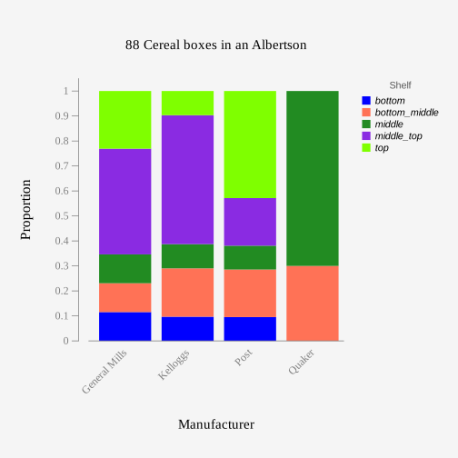

```{r setup, include=FALSE}
# This grey area is called a code chunk, and includes R codes

# This next line turn the code off in the final document:
## This means the codes are not shown in the report
knitr::opts_chunk$set(echo = TRUE) 

# tidyverse is a group of library providing a convenient way of programming R 
## The following code tries to load the package
# if(!require(tidyverse)){
#   # If the package is not loaded, the next code installs it
#   install.packages(tidyverse)
#   # And now it loads it   (`library` fails if it does not exist, unlike `require`)
#   library(tidyverse)
# } 

```


## Introduction

This version of the template shows how to read a data set and show its structre. These can be used to determine the type of variables (categorical or numerical). The data structure should also show how it helps answering our question through the response variable and parameter of interest. 

As an example, let's use the `cereal2` dataset and use it see if the Manufacturer and Shelf are dependent.


### Data
The `cereal2` dataset is collected from an Albertson store in 2019. 

```{r, echo=TRUE}
# This code reads the dataset from a local CSV file:
cerealDS <- read.csv(file = 'cereal2.csv', header = TRUE) 
# this line shows the size of the dataset:
dim(cerealDS)
```

The dataset has 14 variables and 88 observations. Each observation is about a box (a case is a cereal box).

```{r, echo=TRUE}
# This code shows the list of variables
names(cerealDS)  # also `colnames(cerealDS)` works
```
For the question that we are dealing with, the important variables are `Manufacturer` and `Shelf`, both of which are categorical. Here are the first few observations for these variables:

```{r, echo=TRUE}
head(cerealDS[c("Manufacturer", "Shelf")])
```

The above table, also shows the type of the variables, which in this case both are character (not numeric), and thus categorical.


### Parameters of Interest (Models)
Here we can use symbols, such as $\pi$ or $\mu$ to clarify what parameters we are using.

For the purpose of presentation, let's consider `Shelf` as response and `Manufacturer` as explanatory. The parameters that we will use to answer the question would be the proportion of response levels (shelf locations) given the explanatory levels (manufacturers):

- Proportion of Shelf given Manufacturer: $\pi_{shelf|manufacturer}$, where $shelf\in\{\text{top, middle-top, middle, bottom-top, bottom}\}$, and $manufacturer\in\{\text{General Mills, Kelloggs, Post, Quaker}\}$.

In practice, we focus on a set of proportions and use $\pi_1$ to $\pi_k$ for $k$ different events.


## Explanatory Analysis/Descriptive Analysis
### Graphs
Here you can add images of bar plot for each variable to learn about each variable, and a stacked bar plot to show association of the two variable.

We could add graphs generated by Rguroo, like this one:

{height=300px width=400px}.

Also, we can produce the graph from a `cerealDS` which we created by loading a local CSV copy of the data, and `ggplot2` package:

```{r}
library(ggplot2)
ggplot(cerealDS, aes(x=Manufacturer, fill=Shelf)) +
  geom_bar(position = 'fill')
```


### Tables
Similarly, images of Rguoo tables can be added as table outpus. However, we can summaries values in R, as well:

```{r}
with(cerealDS, table(Manufacturer, Shelf))
```
```{r}
with(cerealDS, table(Manufacturer, Shelf)) |>
  prop.table(margin = 1)

```

### Interpretation of Results
In this section, we can use the above tables and graphs to make some comments about where the two variables are assiciated, or estimate a conditional probability.


## Inferential Analysis
TO BE COMPLETED LATER


## Conclusion

TO BE COMPLETED LATER

### Future Study

TO BE COMPLETED LATER

\

\

\


