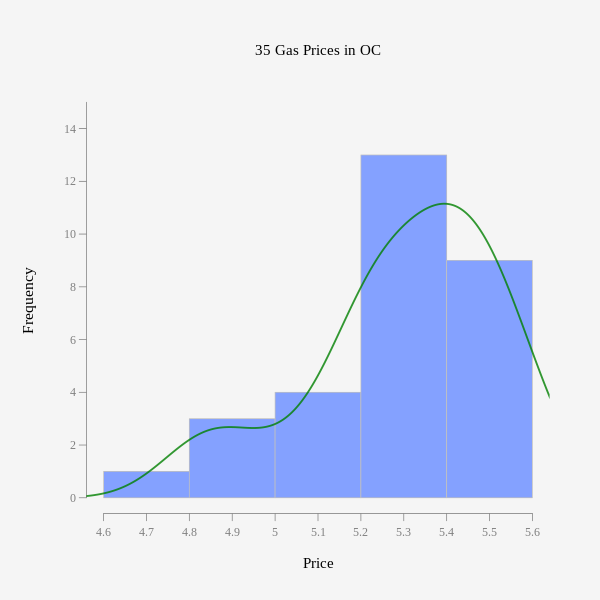
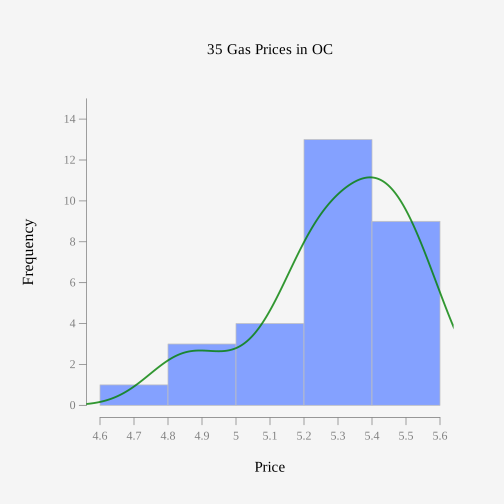

```{r setup, include=FALSE}
# This grey area is called a code chunk, and includes R codes

# This next line turn the code off:
## This means the codes are not shown in the report
knitr::opts_chunk$set(echo = TRUE) 

# tidyverse is a group of library providing a convenient way of programming R 
## The following code tries to load the package
if(!require(tidyverse)){
  # If the package is not loaded, the next code installs it
  install.packages(tidyverse)
  # And now it loads it   (`library` fails if it does not exist, unlike `require`)
  library(tidyverse)
} 
```

> This template create the structure of a typical report for Math 338, and perhaps other statistical reports.

> The default setting will produce a HTML file. Comments are added to provide alternatives, in terms of output format and other features like including image in a document.


## Problem Definition

This section should clarify what is the problem that is being investigated. This includes:

- Questions being answered.

- The dataset which is used.

These two should clarify what _variables_ are collected for which _subjects (cases)_, and their types. They also should determine what are the parameters that will answer the question.


The following sections can be repeated for each questions, or more than one question can be address in each sections:

## Explanatory/Descriptive Analysis
This Section provide graphs and summary tables that describe one or more variables. These descriptive analysis should help us make an opinion about the answer and inform our solution approach.

Here are some simple ways to add an image from a local file:

### Adding image using 

{height=200px width=300px}.

### Using HTML TAG (Only works in HTML OUTPUT)

.

### Using `knitr::include_graphics()`:

```{r, echo=FALSE, fig.cap="Dotplot of OC Gas Price Sample", fig.align='right', fig.width=2, fig.height=1}
knitr::include_graphics(path = "ocGasSample.svg")
```


## Inferential Analysis
In this section, CI or Test of Hypothesis are used to extended the results from a sample to the population where the sample was obtained from.

## Conclusion & Justification

Making conclusions that answer questions that the report was going to answer, and reviewing assumptions to conclude if the results are valid, and if they can be extended to the population.

\

\

\


